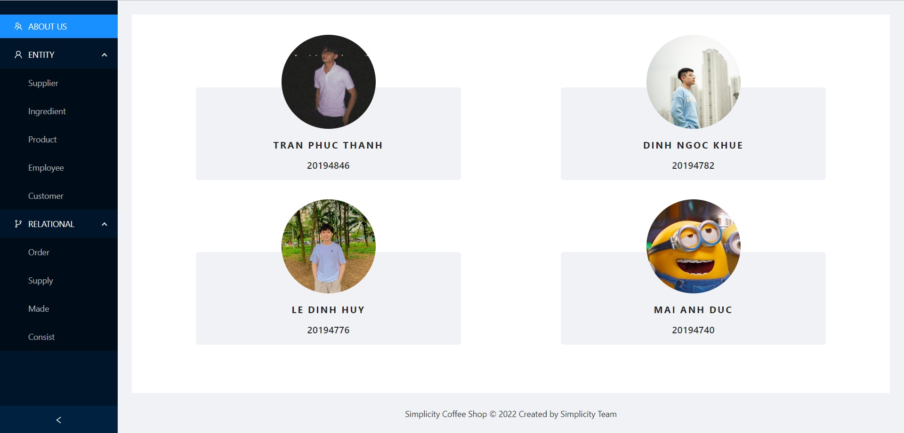
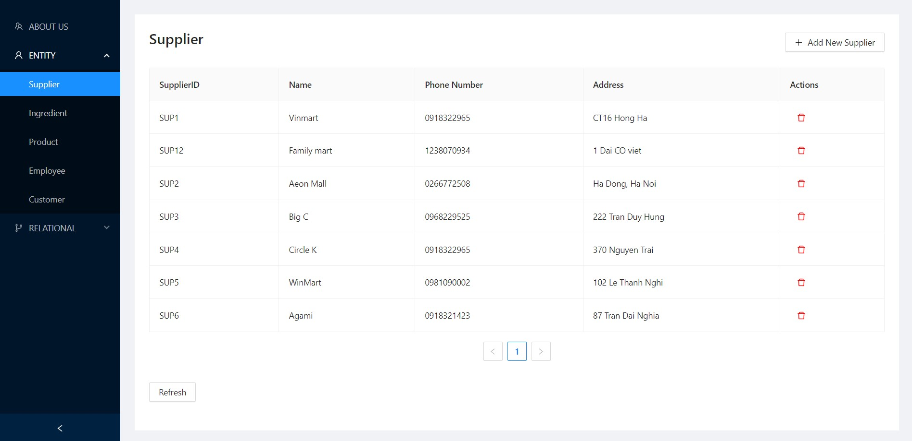
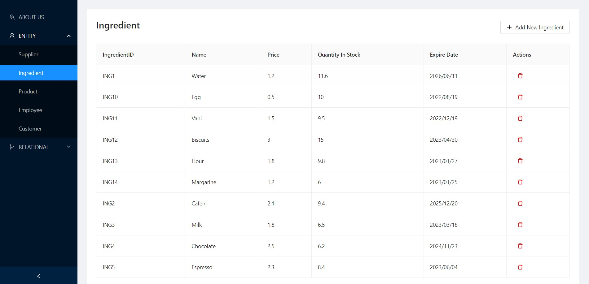
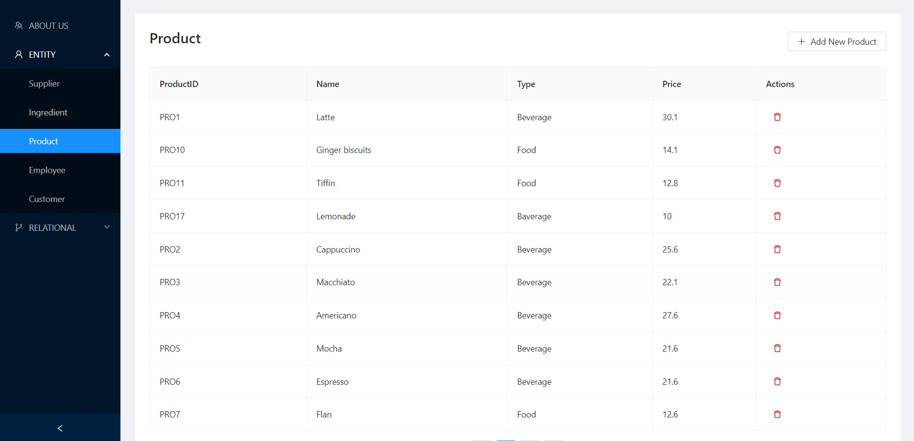
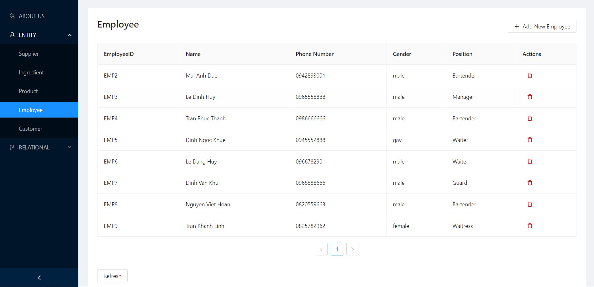
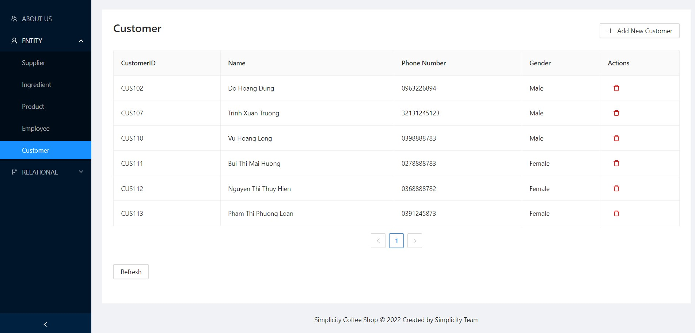
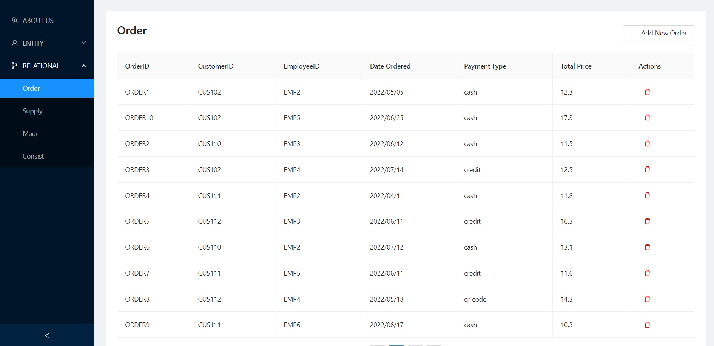
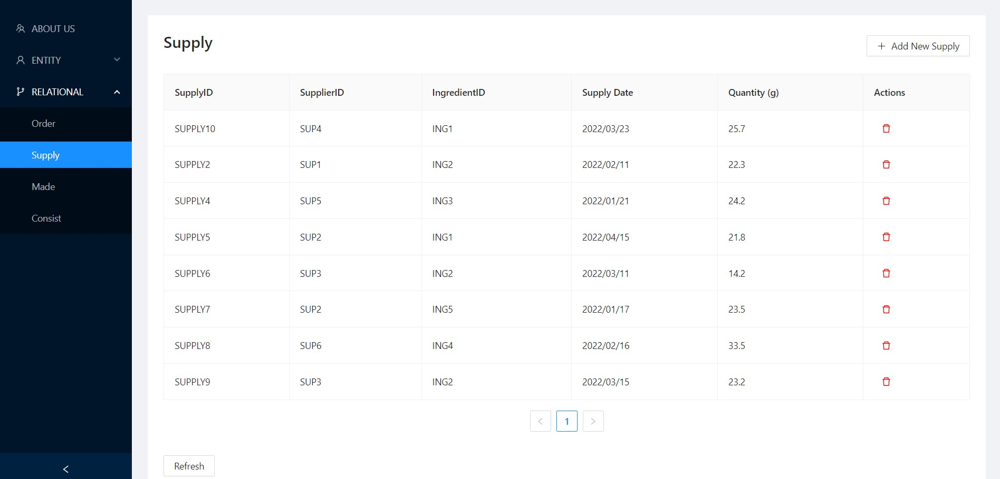
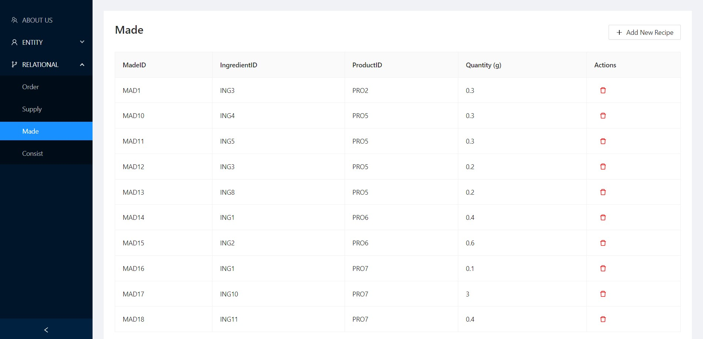
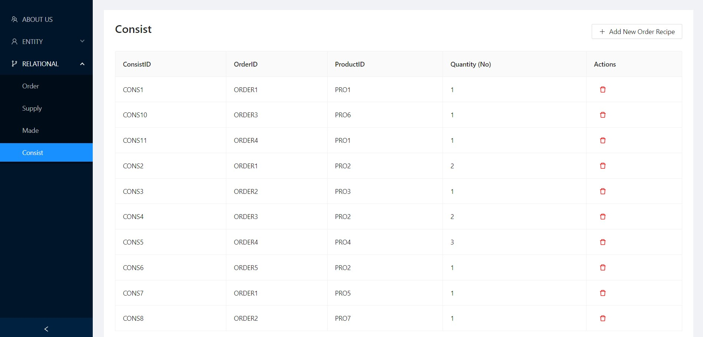

# SIMPLICITY COFFEE SHOP DATABASE MANAGEMENT SYSTEM

## TEAM MEMBERS

| Student            | ID       |
| ------------------ | -------- |
| Mai Anh Đức        | 20194740 |
| Lê Đình Huy        | 20194776 |
| Đinh Ngọc Khuê     | 20194782 |
| Trần Phúc Thành    | 20194846 |

## Overview

**Course Description:**

- Course Name: Database Lab
- Lecturer: Nguyễn Hồng Phương
- Subject Code: IT3290E
- Class Code: 131107

**Project Description:**

Using SERN Stack (SQL ExpressJS ReactJS NodeJS) 

## Usage
### `yarn install`

Download dependencies of resources
### `yarn run serve`

Runs the server

### `yarn start`

Runs the app in the development mode.
Open [http://localhost:3000](http://localhost:3000) to view it in your browser.

